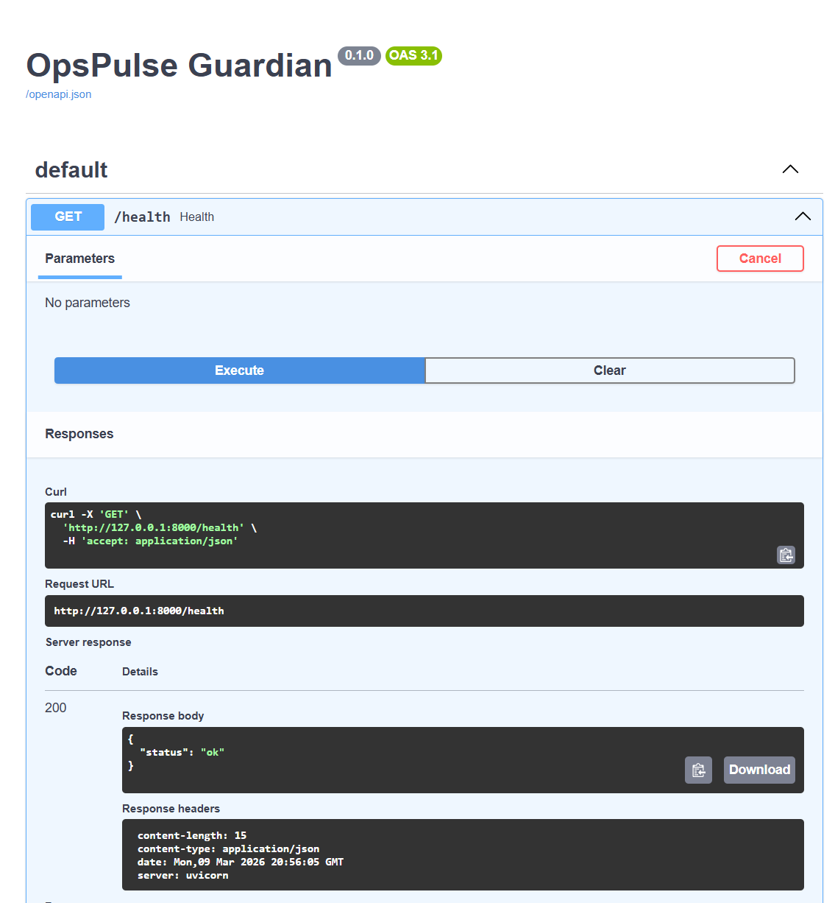

# OpsPulse Guardian

OpsPulse Guardian is an **AI Ops Data Quality Gate + Workflow Copilot**.

It ingests operational datasets (HRIS / property service requests / hotel bookings), runs **data quality checks** + **anomaly detection**, and (next) will generate structured action recommendations with guardrails.

## Current Progress
✅ Module 1: FastAPI app + `/health`
✅ Module 2: `/upload` (CSV upload + storage)  
✅ Module 3B (HRIS): adapter + checks + anomaly detection + PII masking  

## Run locally
pip install -r requirements.txt  
uvicorn api.main:app --reload --port 8000

Open:
- http://127.0.0.1:8000/docs
- http://127.0.0.1:8000/health

  

## Roadmap
- [ ] Property dataset adapter + checks
- [ ] Hotel dataset adapter + checks
- [ ] Streamlit UI
- [ ] LLM summaries + guardrails
- [ ] Docker deployment
